# AWS AppStream + ADUC with Metrics Tracking

This guide covers setting up AWS AppStream with Active Directory integration (including ADUC via custom launch parameters), and configuring usage metrics tracking using VictoriaMetrics, AWS Glue, Lambda, and S3.

---

## Table of Contents

- [1. AD Connector Setup](#1-ad-connector-setup)
- [2. AppStream Setup](#2-appstream-setup)
  - [2.1 Directory Config](#21-directory-config)
  - [2.2 Image Builder](#22-image-builder)
  - [2.3 Create Image with ADUC](#23-create-image-with-aduc)
- [3. Fleet & Stack Setup](#3-fleet--stack-setup)
- [4. Metrics Tracking](#4-metrics-tracking)
  - [4.1 Enable Usage Reports](#41-enable-usage-reports)
  - [4.2 IAM Policies and Roles](#42-iam-policies-and-roles)
  - [4.3 Lambda Function Setup](#43-lambda-function-setup)
  - [4.4 Glue Job Setup](#44-glue-job-setup)
  - [4.5 S3 Event Notification](#45-s3-event-notification)
  - [4.6 Testing](#46-testing)

---

## 1. AD Connector Setup

1. Navigate to **Directory Services** → **Set up directory**
2. Select **AD Connector** → **Next**

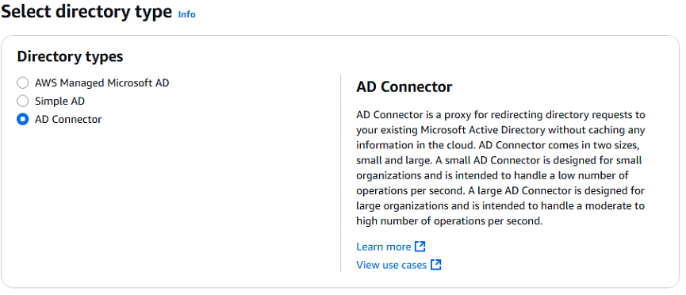

3. Choose **Small** or **Large**, depending on expected user volume

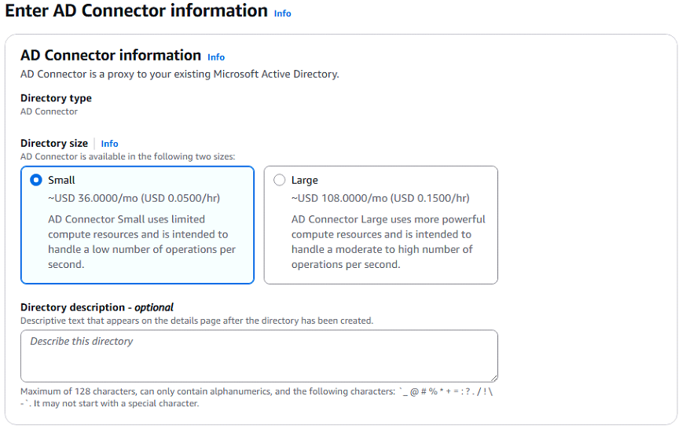

4. Select VPC and private subnets (recommended: NAT gateway access only)

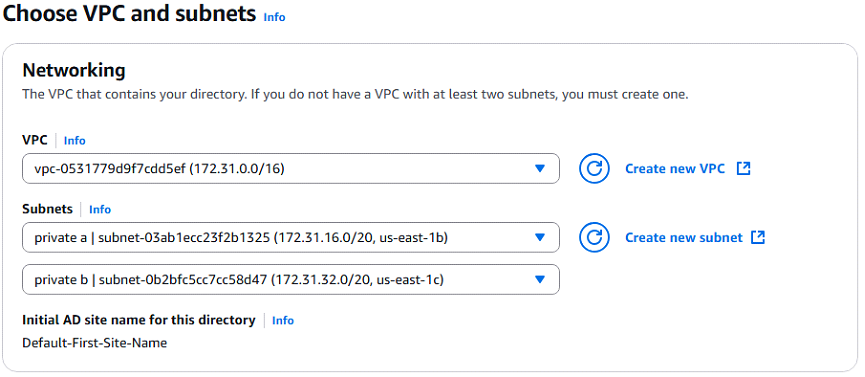

5. Provide:
   - Directory DNS name
   - 1–2 DNS IPs
   - AD service account credentials

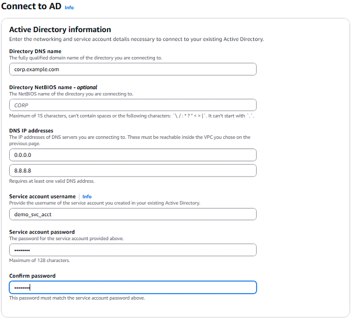

6. Review and click **Create Directory**

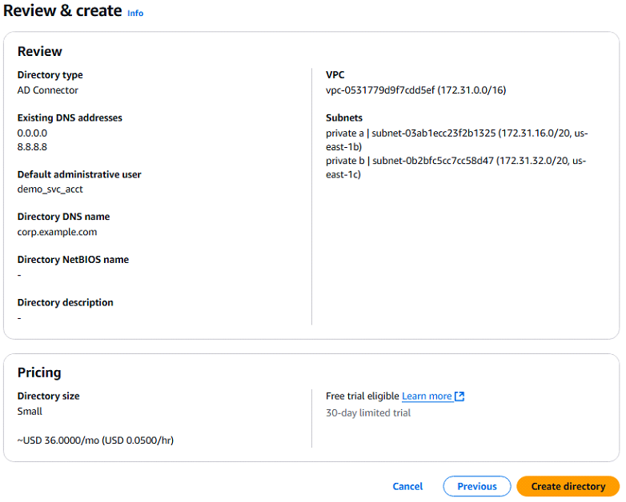

---

## 2. AppStream Setup

### 2.1 Directory Config

1. Go to **AppStream > Directory Configs**

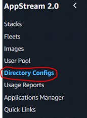

2. Click **Create Directory Config**
3. Provide:
   - Directory Name
   - Service Account: `DOMAIN\username`
   - Password
   - Organizational Unit (OU)

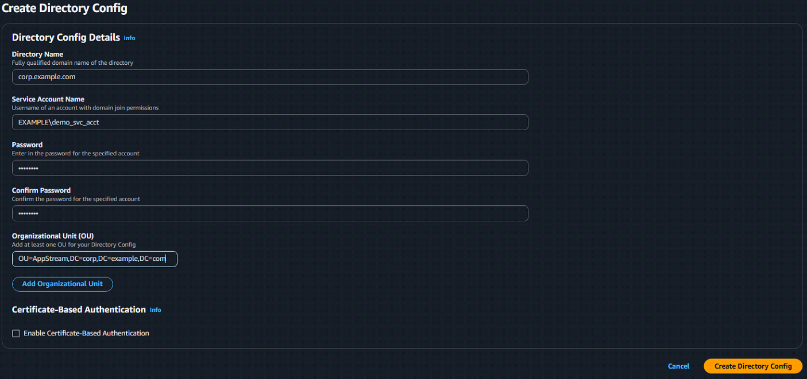

4. Click **Create Directory Config**

### 2.2 Image Builder

1. Go to **AppStream > Images > Launch Image Builder**

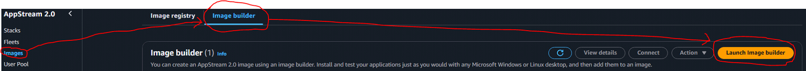

2. Select base image:
   - `AppStream-WinServer2022-05-30-2025 (Public)`
   - Instance type: `large`

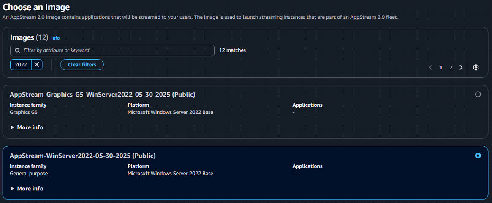
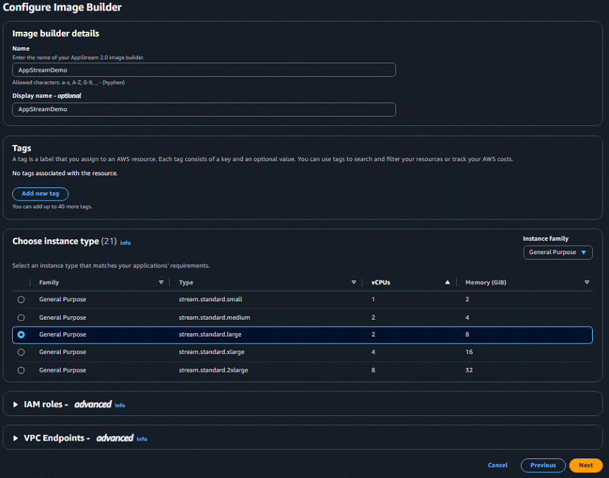

3. Choose:
   - VPC and subnet (private recommended)
   - Security group (default is fine)
   - Directory and OU (for domain join)

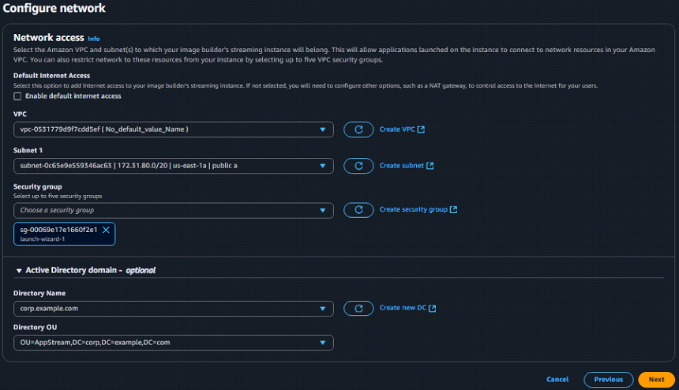

4. Review and launch the image builder

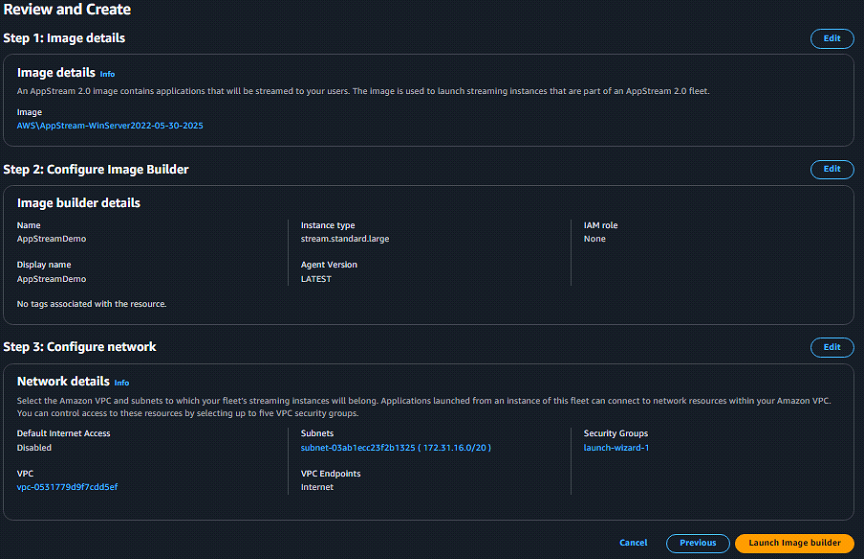

### 2.3 Create Image with ADUC

1. Connect to your **running image builder**

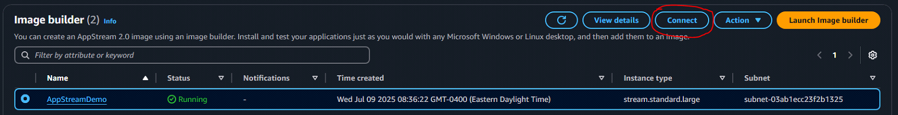

2. Log in as **Administrator**

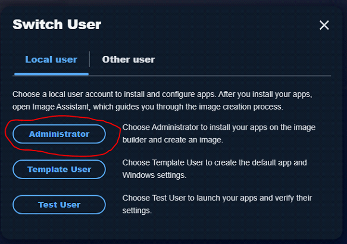

3. Install ADUC:
   - Open Server Manager → Add Roles and Features
   - Feature selection:
     - `Active Directory module for Windows PowerShell`
     - `AD DS Tools`

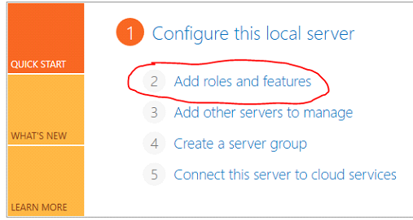
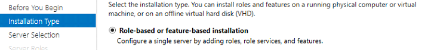
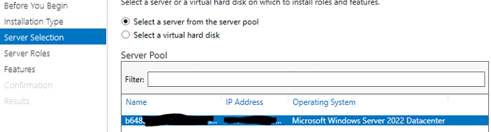
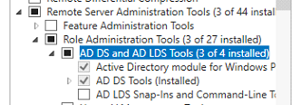

4. Launch **Image Assistant** → Add App:

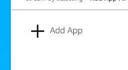

   - Path: `C:\Windows\System32\cmd.exe`


   - Name and Display Name
   - Icon Path (optional)
   - **Launch Parameters**:
     ```
     /c start "ADUC" mmc.exe "C:\Windows\System32\dsa.msc"
     ```
   - Working Directory:
     ```
     C:\Windows\System32
     ```

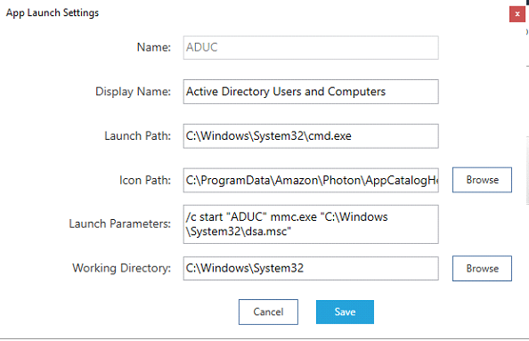

5. Save the app
6. Click through to **Optimize** → Click **Launch**
   - If you get a domain access error, continue or switch users to a domain account


7. On **Configure Image**, enter:
   - Name
   - Display Name
   - Description
8. Click **Disconnect and Create Image**


---

## 3. Fleet & Stack Setup

The rest of this demo will use a Calc image to create an AppStream.
### Fleet


1. Go to **AppStream > Fleets > Create Fleet**
2. Choose:
   - Fleet Type: `On-Demand`

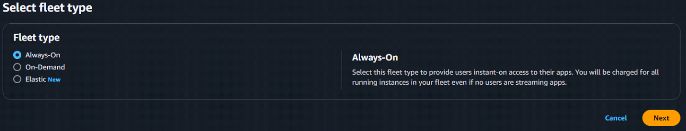

   - Instance Type: `large`

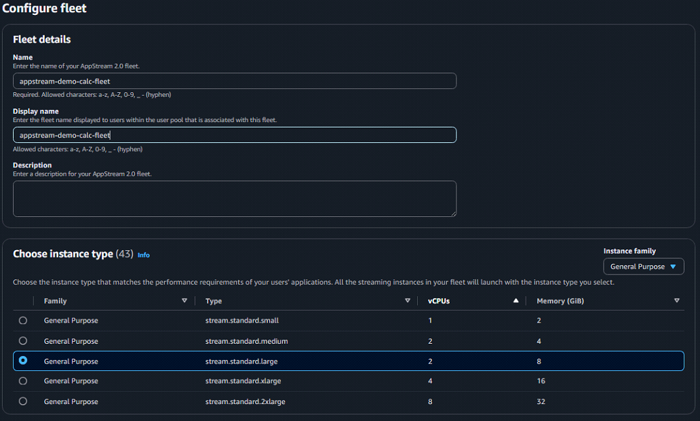

3. Select image, configure:

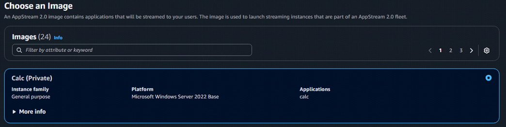

   - VPC, subnets (private preferred)
   - Security group (default)
   - Directory Config & OU (for domain join)

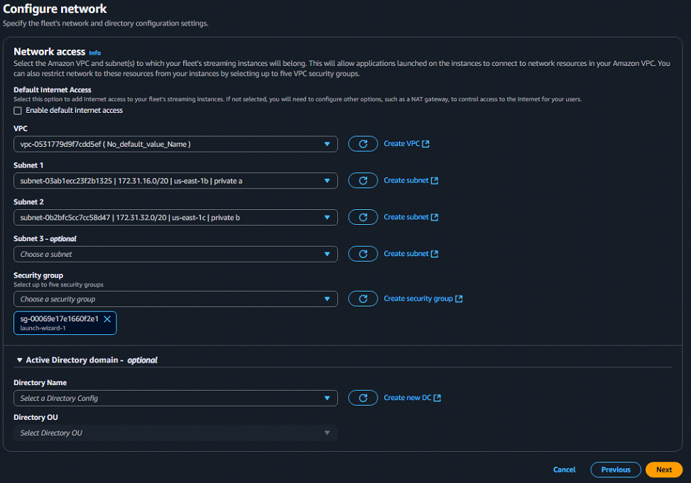

4. Click **Create Fleet**

### Stack

1. Go to **AppStream > Stacks > Create Stack**
2. Provide:
   - Name and Display Name
   - Link to created Fleet

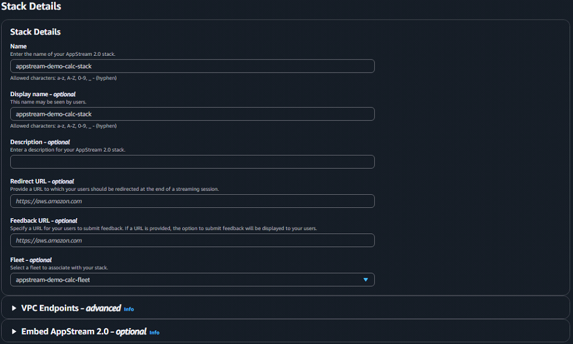

3. Leave defaults for other settings → Click **Next** twice
4. Click **Create Stack**
5. Optional test (non-domain):
   - **Actions > Create Streaming URL**

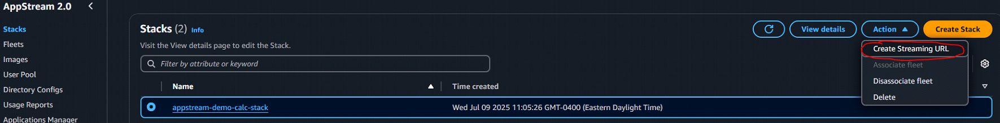

   - Enter User ID, expiration → click **Get URL**

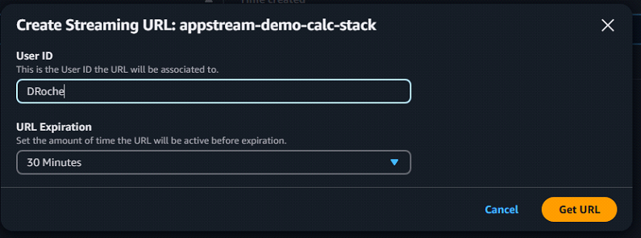

   - Open in browser and launch app

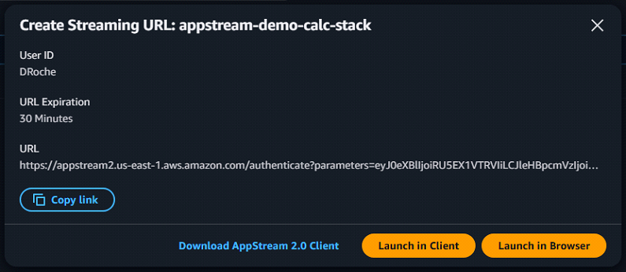
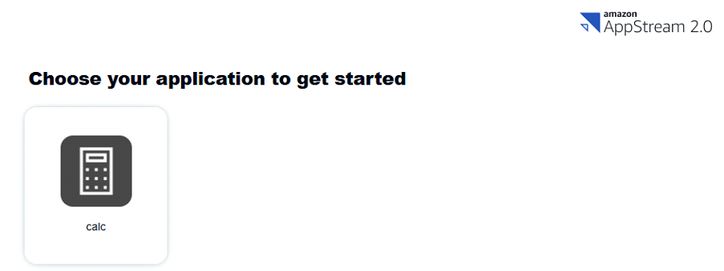

> **Note**: Domain-joined apps require SAML SSO setup to launch.

---

## 4. Metrics Tracking

### 4.1 Enable Usage Reports

1. In **AppStream**, enable **Usage Reports** via the sidebar

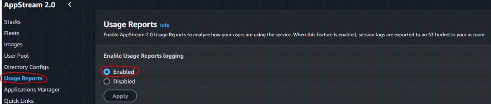

2. AWS will automatically create an S3 bucket to store `.csv` logs

### 4.2 IAM Policies and Roles

#### Script S3 Bucket Policy

```json
{
  "Version": "2012-10-17",
  "Statement": [
    {
      "Effect": "Allow",
      "Action": [
        "s3:GetObject",
        "s3:ListBucket"
      ],
      "Resource": [
        "[Your script bucket ARN]",
        "[Your script bucket ARN]/*"
      ]
    }
  ]
}
```

#### Glue Trigger Lambda Policy

```json
{
  "Version": "2012-10-17",
  "Statement": [
    {
      "Effect": "Allow",
      "Action": [
        "glue:StartJobRun",
        "glue:GetJobRun",
        "glue:GetJobRuns"
      ],
      "Resource": "*"
    },
    {
      "Effect": "Allow",
      "Action": [
        "s3:GetObject",
        "s3:ListBucket"
      ],
      "Resource": "*"
    }
  ]
}
```

#### IAM Roles

- **Glue Job Role**

  - Trusted entity: Glue
  - Attach:
    - `AWSGlueServiceRole`
    - `AmazonS3FullAccess`
    - Custom script bucket policy above

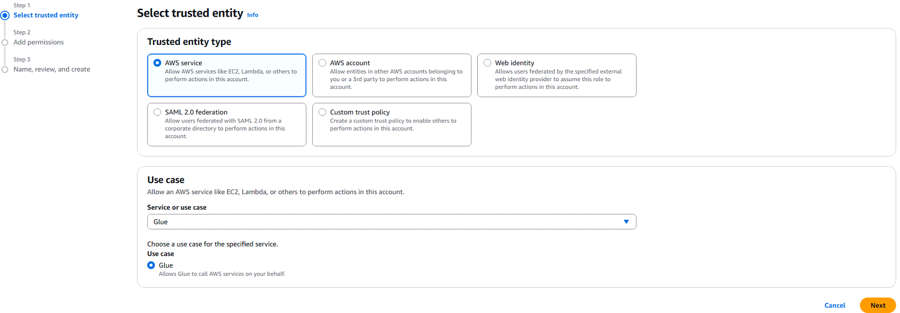
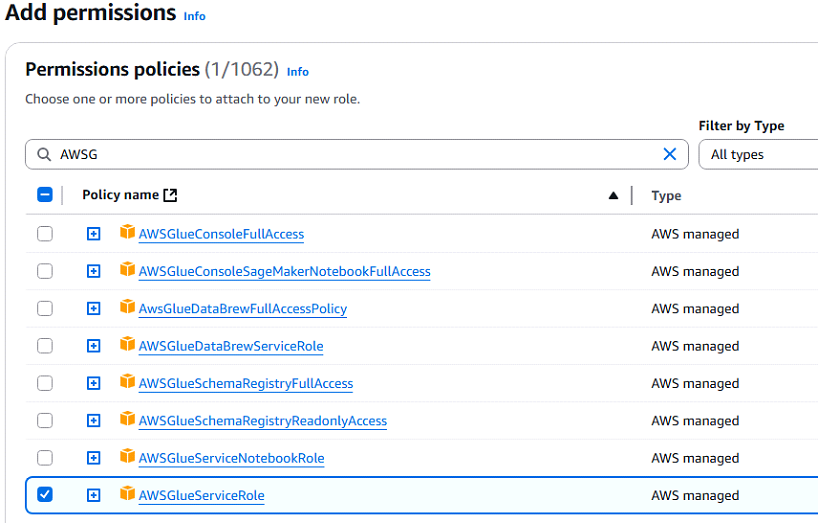

- **Lambda Function Role**

  - Trusted entity: Lambda
  - Attach:
    - `AWSLambdaBasicExecutionRole`
    - Glue trigger policy above

### 4.3 Lambda Function Setup

1. Create Lambda:
   - Author from scratch
   - Runtime: **Python 3.13**
   - Use IAM role from 4.2 (Lambda Role)

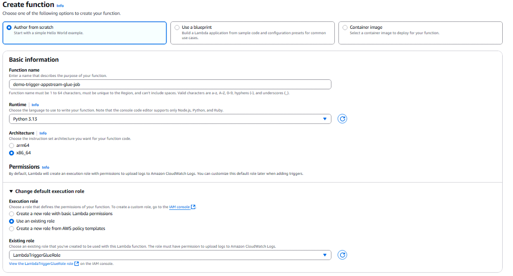

2. In **Code Editor**, paste contents of `glue_lambda.py`
3. Modify:
   - Lines 20–21 for your VictoriaMetrics address and port
   - S3 bucket name (replace `[BUCKET_NAME]`)

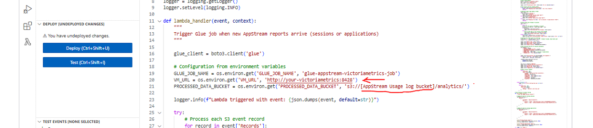

4. Increase timeout:
   - Go to **Configuration > General Configuration**
   - Set timeout to **5 minutes**
5. Add environment variables:
   - Key: `GLUE_JOB_NAME`, Value: Name of your glue job
   - Key: `PROCESSED_DATA_BUCKET`, Value: your usage log S3 bucket name
   - Key: `VM_USERNAME`, Value: Victoria Metrics username
   - Key: `VM_PASSWORD`, Value: Victoria Metrics password
   - Key: `VM_URL`, Value: Victoria Metrics URL

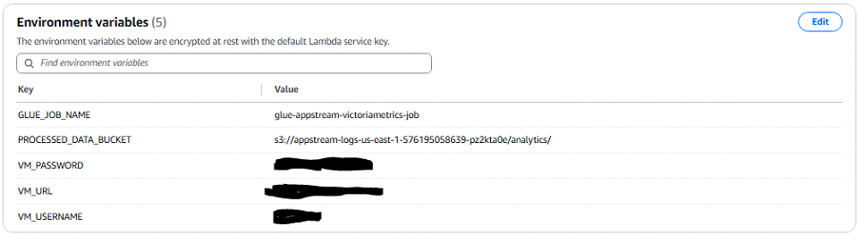

6. Click **Deploy**

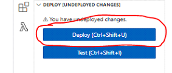

### 4.4 Glue Job Setup

1. Go to **AWS Glue > ETL > Script Editor**
2. Choose:
   - Engine: Spark
   - Upload script: `main.py`

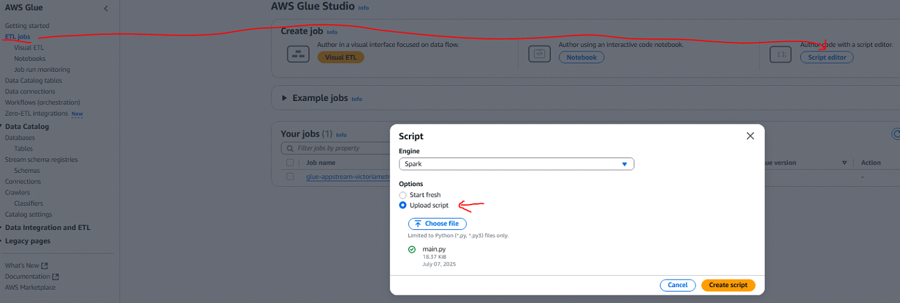

3. Job configuration:
   - Name: `glue-appstream-victoriametrics-job`
   - Role: Glue IAM role from 4.2
   - Requested workers: 2
   - Timeout: 60 minutes
   - Retries: 1

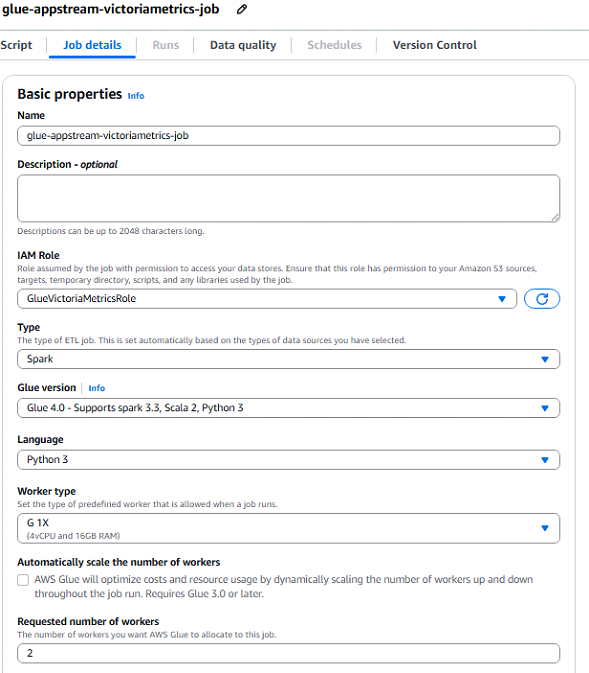
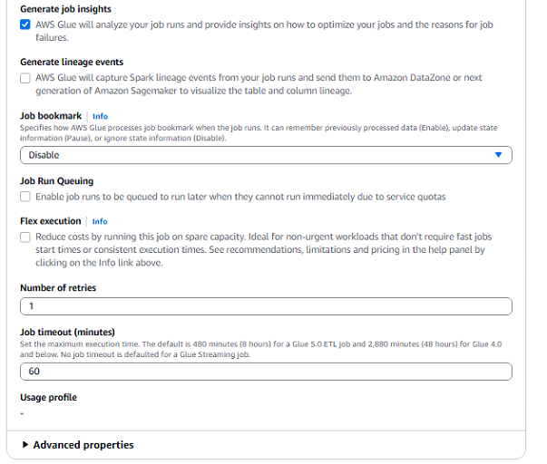

4. Click **Save**

### 4.5 S3 Event Notification

1. Go to the S3 bucket created by AppStream for usage reports
2. Go to **Properties > Event Notifications**
3. Click **Create Event Notification**:
   - Name: e.g., `TriggerGlueOnCSV`
   - Event Types: `PUT` and `POST`
   - Destination: Select your Lambda function
4. Click **Save changes**

### 4.6 Testing

1. Download one `.csv` usage file from the S3 bucket
2. Delete it from the bucket
3. Re-upload it to simulate a new event
4. Go to **AWS Glue > Job Run Monitoring**
5. Confirm the Glue job status changes to **Succeeded**

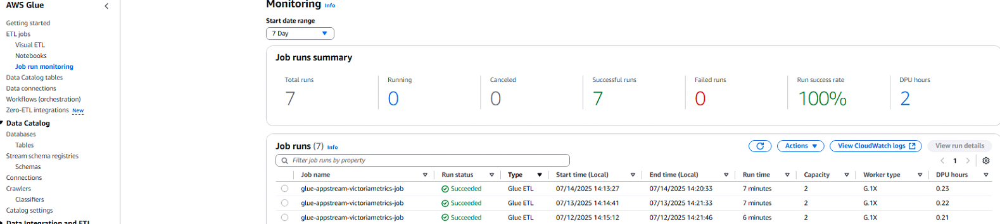

---

## Scripts Used

- `main.py` – Glue ETL job logic
- `victoria_metrics.py` – Handles pushing data to VictoriaMetrics
- `glue_lambda.py` – Lambda trigger for new S3 usage reports

---

## License

This project is for internal demonstration and learning purposes only.
